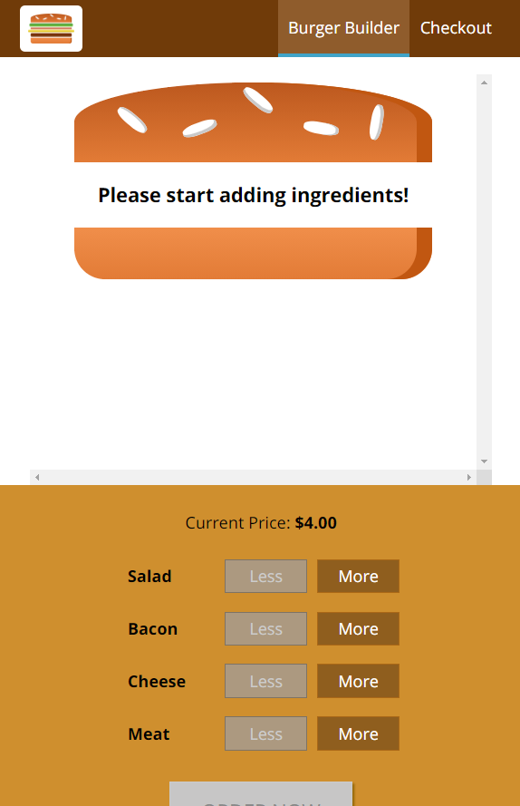
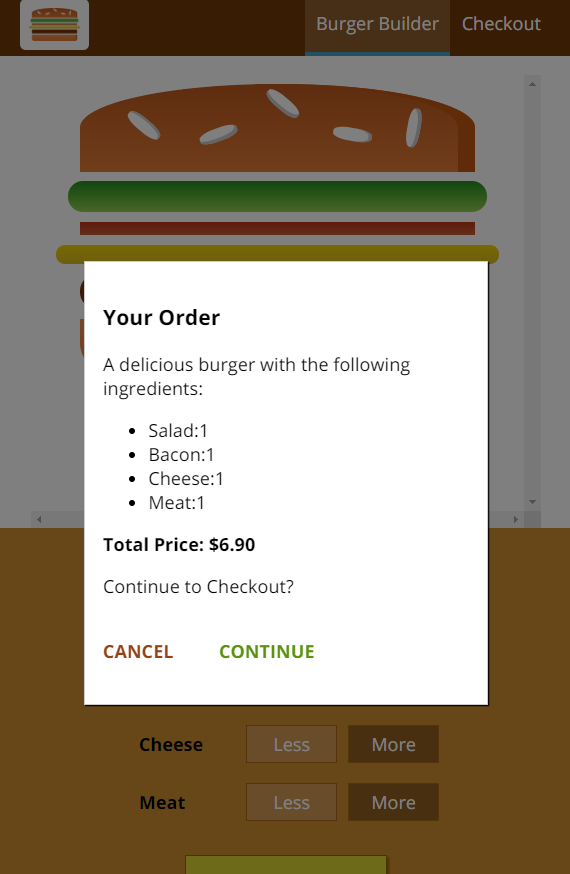
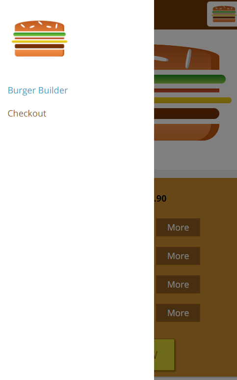

# 🏆 Burger Builder using React.js 🏆

##### **Badge:**

## **Link:**
* https://williamsffc.github.io/Burger-Builder--React.js/

## **Description:**
* You can create your own burger with the ingredients you want. The app will give show you an order summary and price of the final burger before purchasing. 

## **Table of Contents:**
1. [Contribution](#contribution)
2. [Questions](#questions)
3. [Link](#link)
4. [Screenshots](#screenshots) 

## **Contribution:**
* If you want to contribute, please let me know. 

## **Questions:**
* wlliamsffc@gmail.com

## **Link:**
* [GitHub] - https://github.com/williamsffc

## **Screenshots:**

-------------
© Copyright - 2020